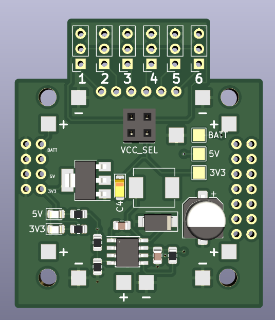

This is a simple power distribution board for personal projects.

Features:

* 5V and 3.3V output
* Can support 2s to 6s LiPo batteries
* 30.5mm x 30.5mm mounting holes
* 6 servo headers
* Pads for ESCs
